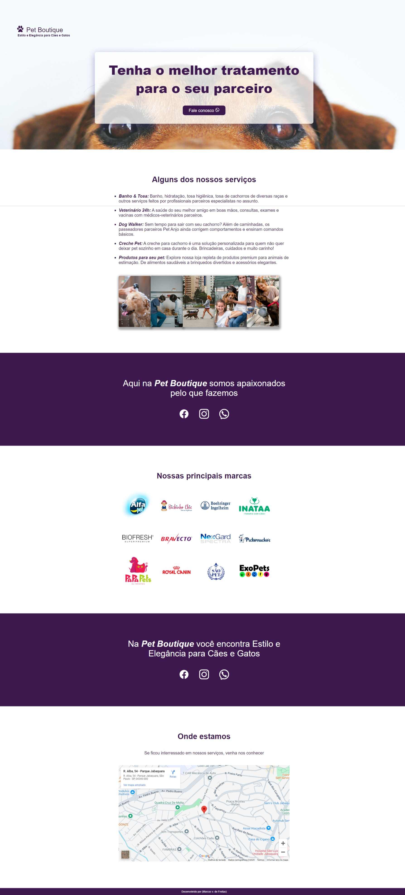

## 🖥 Projeto DevMedia

Website PetShop Pet Boutique

## Sobre o projeto 

O projeto foi desenvolvido com o objetivo de aplicar os novos conhecimentos adquiridos em CSS.
- Valores relativos.
- Largura e altura de elementos (máxima e mínima).
- Preencher elementos com imagem de fundo.
- Efeitos de sombra.
- Box-Sizing.

## Amostra do website 

  
